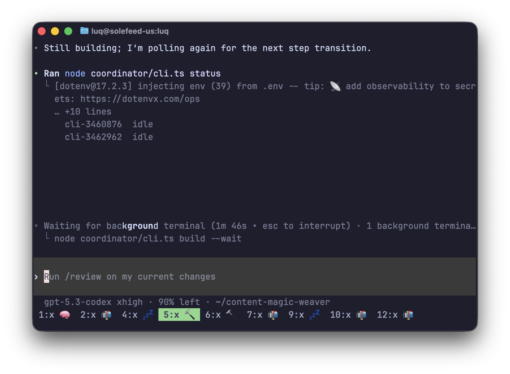

# tmux-agent-emoji

A lightweight daemon that shows what your AI coding agent (Claude Code, Codex CLI) is doing directly in tmux window names.

This repo is named `tmux-agent-emoji`. The installed binary and release assets still use `tmux-ai-status` for compatibility with existing setups.

<p align="center">
  
</p>
<p align="center">
  <em>Live pane activity + unread attention markers, directly in tmux window names.</em>
</p>

```
1:x 🧠  2:x 🔨  3:x 💤  4:x 📬  5:zsh
```

## Why I use this

I run tmux from my phone and keep lots of agent tabs open.

Without this, every tab looks the same and I have to open each one to see what is happening.

This tool gives each tab a simple status icon, so I can instantly see:
- who is still working,
- who is done,
- which tab needs my attention.

It works with both Codex and Claude, so I can switch between them and still get the same status system.

## Statuses

| Emoji | Meaning |
|-------|---------|
| 🧠 | Agent is actively thinking/working |
| 🤖 | Agent has local/background sub-agents running |
| 💤 | Agent is idle / waiting (already seen) |
| 📬 | Unread: agent finished or needs your attention while unfocused |
| 🔨 | Build/compile task |
| 🧪 | Test task |
| 📦 | Package install task |
| 🔀 | Git task |
| 🌐 | Network task |
| ⚙️ | Other subprocess task |

Prefixes:
- `x ` for Codex tabs (example: `x 🧠`)
- `c ` for Claude tabs (example: `c 🧠`)

When no agent is detected, tmux automatic rename is restored (for example `zsh`).

## Detection model

Every 2 seconds the daemon:

1. Lists tmux panes and shell PIDs.
2. Walks `/proc` to find Claude/Codex under each pane shell.
3. Uses **live descendant processes first** to classify status.
4. Falls back to pane text only when no live worker child is active, including Claude/Codex footer signals like `8 local agents`.
5. Applies unread logic and updates the tmux window name.

### Why process-first

This avoids the two failure modes we hit in practice:
- Running in background but prompt visible: should still be active (`🧠`/`🔨`), not `💤`.
- Old spinner text left in scrollback: should not keep tab stuck in `🧠` forever.

### Unread (`📬`) rules

A tab is marked unread only on meaningful unfocused transitions:
- working → idle (completion), or
- prompt/completion signature changes after initial baseline.

Focusing the window clears unread.

## Anti-flicker behavior

- Active grace period: `10s` (`activeGrace`) to survive spinner redraw gaps.
- Stale active marker decay: if the same active marker repeats with a visible prompt for `12s`, it is treated as stale and no longer forces `🧠`.
- Status stability threshold: currently `1` cycle (fast updates).

## Requirements

- Linux (`/proc` access)
- tmux
- `curl` or `wget` for TPM/plugin installs
- Go 1.22+ only if you are building from source or publishing binaries

## Quick Start

If you want the shortest path:

1. Add this to `~/.tmux.conf`:

```tmux
set -g @plugin 'tmux-plugins/tpm'
set -g @plugin 'luqmaan/tmux-agent-emoji'
```

2. Inside tmux, press `prefix + I`.
3. Open a new tmux window and start `codex` or `claude`.
4. Within about 2 seconds, that tmux window name should change to something like `x 🧠`, `c 💤`, or `x 📬`.

## Install

### Option A: TPM plugin (recommended)

Add to `~/.tmux.conf`:

```tmux
set -g @plugin 'tmux-plugins/tpm'
set -g @plugin 'luqmaan/tmux-agent-emoji'
```

Then install plugins with `prefix + I`.

The plugin:
- downloads the latest release binary into `~/.cache/tmux-ai-status/`,
- starts one daemon per tmux server automatically,
- works with custom tmux socket paths,
- does not require systemd.

Do not run the TPM plugin and the systemd service for the same tmux server at the same time.

### Option B: binary download

For Linux `amd64`:

```bash
mkdir -p ~/.local/bin
curl -fsSL https://github.com/luqmaan/tmux-agent-emoji/releases/latest/download/tmux-ai-status-linux-amd64 \
  -o ~/.local/bin/tmux-ai-status
chmod +x ~/.local/bin/tmux-ai-status
```

For Linux `arm64`, replace `linux-amd64` with `linux-arm64`.

### Option C: build from source

```bash
git clone https://github.com/luqmaan/tmux-agent-emoji.git tmux-agent-emoji
cd tmux-agent-emoji
make install
```

This builds `tmux-ai-status` and copies it to `~/.local/bin/tmux-ai-status`.

## How To Use It

1. Run tmux normally.
2. Start `codex` or `claude` inside a tmux window.
3. Watch the tmux window name change based on agent state.

Typical flow:
- `🧠` while the agent is actively thinking or working
- `🔨` / `🧪` / `📦` / `🔀` / `🌐` when a detected subprocess is running
- `💤` when the agent is idle and already seen
- `📬` when the agent finished or needs attention in an unfocused window

Notes:
- `x ` means Codex and `c ` means Claude.
- Focusing a window clears `📬`.
- If no agent is detected, tmux falls back to the normal window name such as `zsh`.

## Running options

### Option A: tmux hook (simple)

Add to `~/.tmux.conf`:

```tmux
set-hook -g session-created 'run-shell -b "pgrep -f tmux-ai-status >/dev/null || ~/.local/bin/tmux-ai-status &"'
```

Reload tmux config:

```bash
tmux source-file ~/.tmux.conf
```

### Option B: systemd user service

Create `~/.config/systemd/user/tmux-ai-status.service`:

```ini
[Unit]
Description=tmux AI status daemon
After=default.target

[Service]
Type=simple
ExecStart=%h/.local/bin/tmux-ai-status
Restart=always
RestartSec=2

[Install]
WantedBy=default.target
```

If your local binary name is different (for example `tmux-ai-status-bin`), update `ExecStart` accordingly.

Enable + start:

```bash
systemctl --user daemon-reload
systemctl --user enable --now tmux-ai-status.service
```

Check status/logs:

```bash
systemctl --user status tmux-ai-status.service
journalctl --user -u tmux-ai-status.service -n 100 --no-pager
```

## Supported agents

- [Claude Code](https://docs.anthropic.com/en/docs/claude-code)
- [Codex CLI](https://github.com/openai/codex)

## Tests

```bash
make test
```

The suite includes regressions for:
- stale spinner vs prompt interactions,
- process-first classification,
- unread transition rules.

## Publishing Release Binaries

TPM installs rely on GitHub release assets named:
- `tmux-ai-status-linux-amd64`
- `tmux-ai-status-linux-arm64`

Publish them with:

```bash
scripts/release-binaries.sh v0.1.0
```

## Development

Work in this repo directly:

```bash
make test
git push origin main
```

## Uninstall

```bash
pkill -f tmux-ai-status
rm -f ~/.local/bin/tmux-ai-status ~/.local/bin/tmux-ai-status-bin
systemctl --user disable --now tmux-ai-status.service 2>/dev/null || true
rm -f ~/.config/systemd/user/tmux-ai-status.service
systemctl --user daemon-reload
```

If you installed via TPM, remove `luqmaan/tmux-agent-emoji` from `~/.tmux.conf`, then press `prefix + alt + u` in tmux or delete `~/.tmux/plugins/tmux-agent-emoji`.

## License

MIT
